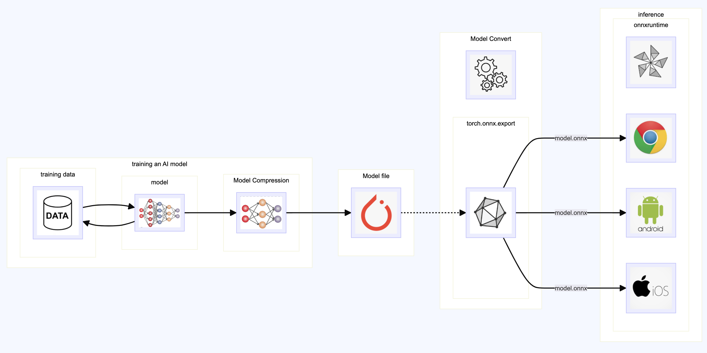

# pt_dnn_edge

- 如何利用邊緣裝置 (例如手機或是 PC 瀏覽器) 來執行模型的推理。
- 假設模型都訓練好了，推理也正常，這裡使用 pytorch 的架構。Edge 端使用 ONNX 框架。
- P.S. 如果使用 tensorflow keras 架構。Edge 端使用 tensorflow.js 及 tensorflow lite。可以參考 [這裡](https://gitlab.com/jiechau/tf_dnn_edge)。

## training data / training an AI model

- 人工智慧系統就像一個複雜的計算機程式, 它能夠接收大量訓練資料, 就如同輸入無數的例題和答案一般。透過機器學習, 這個程式能自動從訓練資料中發現潛在的規則和模式。

- 假設我們有一個待解決的問題, 例如你不知道每種水果的單價, 但卻有過去購買不同組合數量時的總價資料。有了這些歷史資料,我們就希望能得到一種工具, 只要輸入各種水果的數量, 就能推理出應付的總價錢。這裡我們沒有想要知道 單價。

- 訓練資料的形式是,每一筆記錄都包含當次購買的各種水果數量以及實際支付的總價錢。舉例來說,也許有一筆記錄是購買3個西瓜、2個蘋果和1顆葡萄,總價321元。假設我們收集了數以萬計的這種訓練數據。

- 由於這裡說的是邊緣計算。我們先假設這些人工智慧的訓練方式都已經完成，模型也訓練好了，也可以正常使用。
- 訓練好的模型在 [/save/model.pt](https://gitlab.com/jiechau/pt_dnn_edge/blob/main/save/model.pt)，你可以在 [這裡](https://colab.research.google.com/drive/1ZOhMNefzcrAqCh0mQ8q_jgY4h7iLAKIm?usp=sharing) 看到它執行推理: 輸入不同數量的 西瓜/蘋果/葡萄，可以推理出總價錢。

## Model Compression 

- 訓練出來的模型可以經由一些手段 (例如量化 Quantization) 進行壓縮，代價是正確率會降低。
- 壓縮一般都在模型訓練完成後進行。也可以在 Model Convert 轉檔完成後 (Post-Training Quantization using ONNX Runtime)。

## Model Convert

- 將訓練好的模型轉為 ONNX Runtime 可以讀取的格式。Edge 端的 瀏覽器例如 chrome 就能運行.
    - 轉出的檔案是: 一個 model.onnx 檔案，[這裡](https://gitlab.com/jiechau/pt_dnn_edge/-/tree/main/onnx/model.onnx?ref_type=heads)。
    - 將這些檔案交給前端開發人員
    - 將這些檔案交給 手機 開發人員

## inference

- Edge 端的瀏覽器
    - chrome 範例如 [index.html](https://jiechau.gitlab.io/pt_dnn_edge/index.html)，( [原始檔案](https://gitlab.com/jiechau/pt_dnn_edge/-/tree/main/public?ref_type=heads) )

- Edge 端的行動裝置
    - andriod 範例
    - ios 範例 [這裡](https://gitlab.com/django_lin/tf_lite_iOS/-/tree/main?ref_type=heads)

